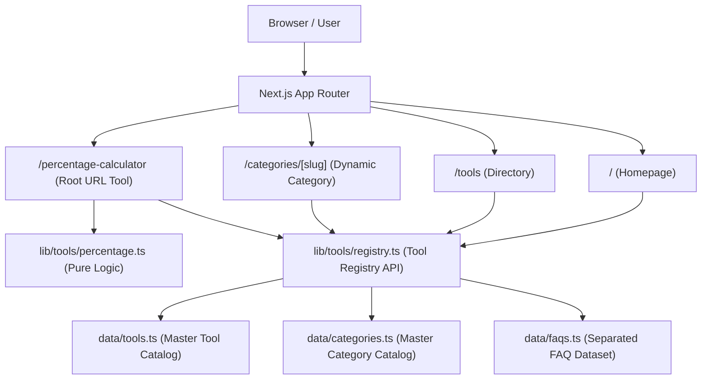

# System Architecture — IJMM TOOLS

**Owner:** IJMM System
**Product:** IJMM Tools
**Version:** 1.0.0

---

## 1. System Overview

IJMM Tools is designed as a single-instance, high-performance web platform built on **Next.js App Router** with **TypeScript** and **Tailwind CSS**. It serves free web utilities to end-users without requiring user authentication, database lookups, or heavy backend computations.

---

## 2. Key Architecture Pillars

### 2.1 Tool Registry Architecture & Single Source of Truth
The `ToolRegistry` (`lib/tools/registry.ts`) serves as the **Single Source of Truth** for the entire platform.
- **Master Data Files:** `data/tools.ts` (Tools), `data/categories.ts` (Categories), `data/faqs.ts` (FAQs).
- **Separation of Concerns:** Data datasets contain zero UI JSX, raw mathematical logic, or long-form articles.

#### Status Lifecycle Rules:
- **`active`:** Fully implemented tools. Render public indexable pages (e.g. `/percentage-calculator`). Included in sitemaps, homepage, directory, and search results.
- **`planned`:** Registered MVP candidates for roadmap tracking. **MUST NOT** generate public indexable pages or thin placeholder routes.
- **`deprecated`:** Legacy tools no longer promoted.

#### Slug & Category Rules:
- **Slugs:** Lowercase, hyphenated, URL-safe (`/^[a-z0-9]+(?:-[a-z0-9]+)*$/`). Stable once published.
- **Categories:** 8 official categories (`calculators`, `developer-tools`, `pdf-tools`, `image-tools`, `generators`, `converters`, `security-tools`, `ecuador-tools`). Category IDs are mandatory and validated.

#### In-Memory Search Engine:
- `searchTools(query)` operates 100% in-memory without database dependencies.
- Case-insensitive and accent-tolerant NFD normalization over `name`, `shortDescription`, `description`, `keywords`, and `categoryId`.

#### Relationship Safety (`getRelatedTools`):
- `getRelatedTools(toolId)` returns ONLY `status: "active"` tools to prevent broken internal links.

---

### 2.2 Routing & URL Strategy
- **Primary SEO Tools:** Mounted as root-level routes (e.g., `/percentage-calculator`).
- **No Duplicate Indexable Content:** Primary tools do NOT generate `/tools/percentage-calculator` duplicates.
- **Directory:** `/tools` lists active tools with search and filter capabilities.
- **Categories:** `/categories/[slug]` dynamically renders tools belonging to a specific category.

---

### 2.3 Separation of Logic & UI
- Pure functions in `lib/tools/<tool>.ts`.
- Zero UI references or DOM manipulations inside mathematical/processing logic.
- Automated unit testing target `lib/tools/` directly.
- Shared execution contracts live in `lib/tools/engine.ts`; see `docs/tool-engine.md`.

---

### 2.4 Design System & Styling Architecture
- **Token System (`app/globals.css`):** Centralized CSS variables mapped to Tailwind CSS v4 `@theme inline`.
- **Base Component Library (`components/ui/`):** Lightweight reusable components (`Container`, `Button`, `Input`, `Select`, `Label`, `Card`, `Badge`, `Alert`, `Divider`, `Skeleton`) built only with the approved stack.
- **Tool UI Foundation (`components/tools/`):** `ToolShell`, `ToolHeader`, `ToolContent`, and `ToolResult` provide reusable composition while `ToolLayout` preserves compatibility for existing routes.
- **Theme Preparation:** Light tokens are the default and dark tokens follow the operating-system preference without client-side theme JavaScript.
- **Mobile-First Responsive Support:** Tested across 320px, 375px, 430px, 768px, 1024px, 1280px+.
- **Accessibility & Reduced Motion:** Native keyboard navigation, visible focus rings (`focus-visible:ring-2`), and `prefers-reduced-motion` compliance.

---

### 2.5 Analytics & Advertising Boundary
- Vendor-agnostic event tracker: `trackEvent(eventName, payload)` in `lib/analytics/events.ts`.
- Advertising is isolated behind `AdSenseScript`, `AdPlaceholder`, and validated public configuration in `lib/ads/config.ts`.
- The integration fails closed: invalid IDs, a disabled flag, or incomplete consent configuration render no script and no ad units.
- Ad units never receive tool inputs or calculated results.
