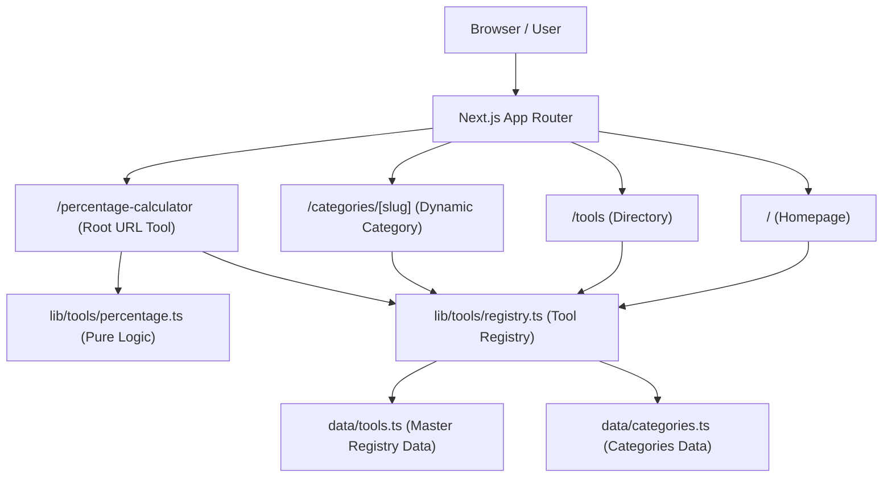

# System Architecture — IJMM TOOLS

**Owner:** IJMM SYSTEM  
**Product:** IJMM Tools  
**Version:** 1.0.0

---

## 1. System Overview

IJMM Tools is designed as a single-instance, high-performance web platform built on **Next.js App Router** with **TypeScript** and **Tailwind CSS**. It serves free web utilities to end-users without requiring user authentication, database lookups, or heavy backend computations.

---

## 2. Key Architecture Pillars

### 2.1 Tool Registry System
The `ToolRegistry` serves as the single source of truth for tool definitions.
- **Master Data Location:** `data/tools.ts`
- **Registry API:** `lib/tools/registry.ts`
- **Tool Statuses:** `active`, `planned`, `deprecated`.
- **Enforcement:** Tools marked with `status: "planned"` are visible in registry metadata for internal mapping, but do NOT render public indexable pages.

### 2.2 Routing & URL Strategy
- **Primary SEO Tools:** Mounted as root-level routes (e.g., `/percentage-calculator`).
- **No Duplicate Indexable Content:** Primary tools do NOT generate `/tools/percentage-calculator` duplicates.
- **Directory:** `/tools` lists active tools with search and filter capabilities.
- **Categories:** `/categories/[slug]` dynamically renders tools belonging to a specific category.

### 2.3 Separation of Logic & UI
- Pure functions in `lib/tools/<tool>.ts`.
- Zero UI references or DOM manipulations inside mathematical/processing logic.
- Automated unit testing target `lib/tools/` directly.

### 2.4 Design System & Styling
- Color tokens defined in `globals.css` using CSS variables mapped to Tailwind CSS.
- Complete responsive support across 320px, 375px, 768px, 1024px, 1440px.

### 2.5 Analytics & Advertising Abstraction
- Vendor-agnostic event tracker: `trackEvent(eventName, payload)` in `lib/analytics/events.ts`.
- Non-intrusive public advertisement placement via `AdPlaceholder.tsx`.
